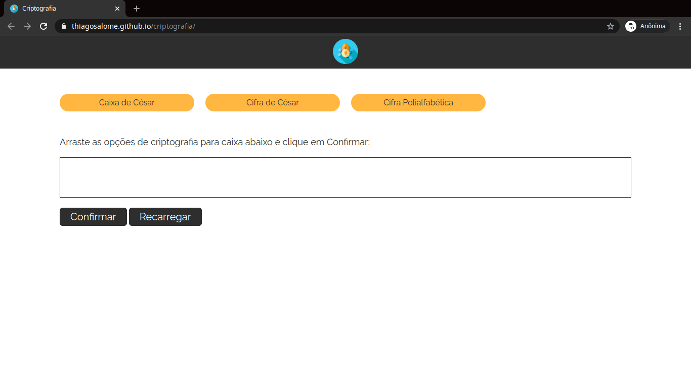
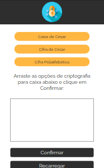

<!-- Logo -->
<h1 align="center">
  
  Criptografia
</h1>

<!-- Badges -->
<p align="center">
  <a href="https://thiagosalome.github.io/dragon-crypt/dist/" target="_blank">
  
  
  
  
</p>

<!-- Indice-->
<p align="center">
 <a href="#computer-sobre">Sobre</a> •
 <a href="#gear-funcionalidades">Funcionalidades</a> •
 <a href="#wrench-tecnologias-utilizadas">Tecnologias</a> •
 <a href="#movie_camera-preview">Preview</a> •
 <a href="#rocket-executando-o-projeto">Executando</a> •
 <a href="#memo-licença">Licença</a>
</p>

## :computer: Sobre

Esse projeto buscar criptografar um determinado texto de entrada a partir de um ou mais tipos de criptografias selecionados pelo usuário, sendo eles a Caixa de César, a Cifra de César e a Cifra Polialfabética.

## :gear: Funcionalidades

- [x] Criptografar e Descriptografar um texto utilizando:
  - [x] Caixa de César
  - [x] Cifra de César
  - [x] Cifra de Poalfabética

## :wrench: Tecnologias Utilizadas

<table>
  <tbody>
    <tr>
      <td align="center">
        
        <p>HTML</p>
      </td>
      <td align="center">
        
        <p>CSS</p>
      </td>
      <td align="center">
        
        <p>Javascript</p>
      </td>
      <td align="center">
        
        <p>jQuery</p>
      </td>
    </tr>
  </tbody>
</table>

## :movie_camera: Preview

### Web Desktop



### Web Mobile



## :rocket: Executando o projeto

### Pré-requisitos

Para executar o projeto é necessário ter instalado as seguintes ferramentas:

<table>
  <tbody>
    <tr>
      <td align="center">
        <a href='https://git-scm.com/downloads' target='_blank'>
          
          <p>GIT</p>
        </a>
      </td>
    </tr>
  </tbody>
</table>

### Rodando aplicação web

```bash
# Clone este repositório
$ git clone https://github.com/thiagosalome/criptografia

# Acesse a pasta do projeto no seu terminal/cmd
$ cd criptografia

# Abra com arquivo index.html com o navegador de sua preferência
```

## :memo: Licença

Este projeto esta sobe a licença [MIT](./LICENCE).
